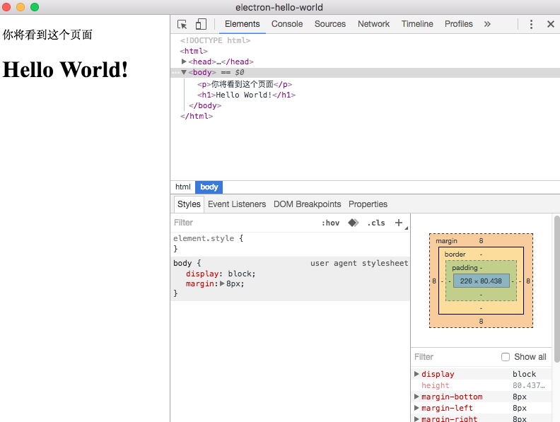

# electron Helloworld  
本文参考https://segmentfault.com/a/1190000005363765?utm_source=tuicool&utm_medium=referral，写的第一个electron例子，helloworld
```  
npm install  
npm start  
```

1.新建index.html，main.js（这个名字要和package.json里面的main对应的写的js指向名字一样）  
2.npm install electron --save,这句话是把electron的npm包下载并保存记录到package.json  
3.添加"start": "electron .",到package.json里面的"scripts"里面。这句话是让项目可以用
npm start 运行，当运行npm start 时，会实际运行electron . 这句，这句是用electron命令运行electron项目，如果sudo npm install electron -g全局安装了electron，可以直接electron .启动项目。

运行如下图：  
